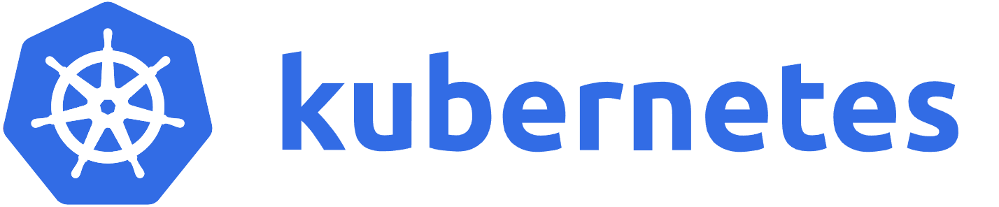

.. role:: htm(raw)
  :format: html
.. role:: pdf(raw)
  :format: latex pdflatex
.. |K8sLogo| image:: https://raw.githubusercontent.com/kubernetes/kubernetes/master/logo/logo.png
  :alt: K8s Logo
  :height: 50
  :class: img-valign-bottom
  :target: https://kubernetes.io

.. _KubeClient: https://www.nuget.org/packages/KubeClient
.. _Ocelot.Provider.Kubernetes: https://www.nuget.org/packages/Ocelot.Provider.Kubernetes
.. _package: https://www.nuget.org/packages/Ocelot.Provider.Kubernetes

|K8sLogo| Kubernetes (K8s) [#f1]_
=================================

    | Feature of: :doc:`../features/servicediscovery`
    | Quick Links: `K8s Website <https://kubernetes.io/>`_ | `K8s Documentation <https://kubernetes.io/docs/>`_ | `K8s GitHub <https://github.com/kubernetes/kubernetes>`_

Ocelot will call the `K8s <https://kubernetes.io/>`_ endpoints API in a given namespace to get all of the endpoints for a pod and then load balance across them.
Ocelot used to use the services API to send requests to the `K8s`_ service but this was changed in pull request `1134`_ because the service did not load balance as expected.

Our NuGet `Ocelot.Provider.Kubernetes`_ extension package is based on the `KubeClient`_ package.
For a comprehensive understanding, it is essential refer to the `KubeClient`_ documentation.

.. _k8s-install:

Install
-------

The first thing you need to do is install the `package`_ that provides |logo-kubernetes| support in Ocelot:

.. code-block:: powershell

    Install-Package Ocelot.Provider.Kubernetes

``AddKubernetes(bool)`` method
------------------------------

.. code-block:: csharp
  :emphasize-lines: 3

  public static class OcelotBuilderExtensions
  {
      public static IOcelotBuilder AddKubernetes(this IOcelotBuilder builder, bool usePodServiceAccount = true);
  }

This extension-method adds `K8s`_ services **with** or **without** using a pod service account.
Then add the following to your `Program <https://github.com/ThreeMammals/Ocelot/blob/main/samples/Kubernetes/ApiGateway/Program.cs>`_:

.. code-block:: csharp
  :emphasize-lines: 3

  builder.Services
      .AddOcelot(builder.Configuration)
      .AddKubernetes(); // usePodServiceAccount is true

If you have services deployed in Kubernetes, you will normally use the naming service to access them.

1. By default the ``useServiceAccount`` argument is true, which means that Service Account using Pod to access the service of the `K8s`_ cluster needs to be Service Account based on RBAC authorization:

   You can replicate a Permissive using RBAC role bindings (see `Permissive RBAC Permissions <https://kubernetes.io/docs/reference/access-authn-authz/rbac/#permissive-rbac-permissions>`_),
   `K8s`_ API server and token will read from pod.

   .. code-block:: bash

     kubectl create clusterrolebinding permissive-binding --clusterrole=cluster-admin --user=admin --user=kubelet --group=system:serviceaccounts

   Finally, it creates the `KubeClient`_ from pod service account.

2. When the ``useServiceAccount`` argument is false, you need to provide `KubeClientOptions <https://github.com/search?q=repo%3AThreeMammals%2FOcelot%20KubeClientOptions&type=code>`_ to create `KubeClient`_ using them.
   You have to bind the options configuration section for the DI ``IOptions<KubeClientOptions>`` interface or register a custom action to initialize the options:

   .. code-block:: csharp
    :emphasize-lines: 9, 10, 13

     Action<KubeClientOptions> configureKubeClient = opts => 
     { 
         opts.ApiEndPoint = new UriBuilder("https", "my-host", 443).Uri;
         opts.AccessToken = "my-token";
         opts.AuthStrategy = KubeAuthStrategy.BearerToken;
         opts.AllowInsecure = true; 
     };
     builder.Services
         .AddOptions<KubeClientOptions>()
         .Configure(configureKubeClient); // manual binding options via IOptions<KubeClientOptions>
     builder.Services
         .AddOcelot(builder.Configuration)
         .AddKubernetes(false); // don't use pod service account, and IOptions<KubeClientOptions> is reused

   .. _break: http://break.do

      **Note**, this could also be written like this (shortened version):

      .. code-block:: csharp
        :emphasize-lines: 2, 10

        builder.Services
            .AddKubeClientOptions(opts =>
            {
                opts.ApiEndPoint = new UriBuilder("https", "my-host", 443).Uri;
                opts.AuthStrategy = KubeAuthStrategy.BearerToken;
                opts.AccessToken = "my-token";
                opts.AllowInsecure = true;
            })
            .AddOcelot(builder.Configuration)
            .AddKubernetes(false); // don't use pod service account, and client options provided via AddKubeClientOptions

   Finally, it creates the `KubeClient`_ from your options.

    **Note 1**: For understanding the ``IOptions<TOptions>`` interface, please refer to the Microsoft Learn documentation: `Options pattern in .NET <https://learn.microsoft.com/en-us/dotnet/core/extensions/options>`_.

    **Note 2**: Please consider this Case 2 as an example of manual setup when you **do not** use a pod service account.
    We recommend using our official extension method, which receives an ``Action<KubeClientOptions>`` argument with your options: refer to the :ref:`k8s-addkubernetes-action-method` below.

.. _k8s-addkubernetes-action-method:

``AddKubernetes(Action<KubeClientOptions>)`` method [#f2]_
----------------------------------------------------------

.. code-block:: csharp
  :emphasize-lines: 3

  public static class OcelotBuilderExtensions
  {
      public static IOcelotBuilder AddKubernetes(this IOcelotBuilder builder, Action<KubeClientOptions> configureOptions, /*optional params*/);
  }

This extension method adds `K8s`_ services **without** using a pod service account, explicitly calling an action to initialize configuration options for `KubeClient`_.
It operates in two modes:

1. If ``configureOptions`` is provided (action is not null), it calls the action, ignoring all optional arguments.

   .. code-block:: csharp
    :emphasize-lines: 8

    Action<KubeClientOptions> configureKubeClient = opts => 
    {
        opts.ApiEndPoint = new UriBuilder("https", "my-host", 443).Uri;
        // ...
    };
    builder.Services
        .AddOcelot(builder.Configuration)
        .AddKubernetes(configureKubeClient); // without optional arguments

.. _break: http://break.do

     **Note**: Optional arguments do not make sense; all settings are defined inside the ``configureKubeClient`` action.

2. If ``configureOptions`` is not provided (action is null), it reads the global ``ServiceDiscoveryProvider`` :ref:`k8s-configuration` options and reuses them to initialize the following properties:
   ``ApiEndPoint``, ``AccessToken``, and ``KubeNamespace``, finally initializing the rest of the properties with optional arguments.

   .. code-block:: csharp
    :emphasize-lines: 3, 5

    builder.Services
        .AddOcelot(builder.Configuration)
        .AddKubernetes(null, allowInsecure: true, /*optional args*/) // shortened version
        // or
        .AddKubernetes(configureOptions: null, allowInsecure: true, /*optional args*/); // long version

.. _break2: http://break.do

     **Note**: Optional arguments must be used here in addition to the options coming from the global ``ServiceDiscoveryProvider`` :ref:`k8s-configuration`.
     Find the comprehensive documentation in the C# code of the `AddKubernetes <https://github.com/search?q=repo%3AThreeMammals%2FOcelot+%22public+static+IOcelotBuilder+AddKubernetes%28this+IOcelotBuilder+builder%2C%22+language%3AC%23&type=code>`_ methods.

.. _k8s-configuration:

Configuration
-------------

The following examples show how to set up a route that will work in Kubernetes.
The most important thing is the ``ServiceName`` which is made up of the Kubernetes service name.
We also need to set up the ``ServiceDiscoveryProvider`` in ``GlobalConfiguration``.

``Kube`` provider
^^^^^^^^^^^^^^^^^

The example here shows a typical configuration:

.. code-block:: json

  "Routes": [
    {
      "ServiceName": "my-service",
      // ...
    }
  ],
  "GlobalConfiguration": {
    "ServiceDiscoveryProvider": {
      "Scheme": "https",
      "Host": "my-host",
      "Port": 443,
      "Token": "my-token",
      "Namespace": "Dev",
      "Type": "Kube"
    }
  }

Service deployment in ``Dev`` namespace, and discovery provider type is ``Kube``, you also can set :ref:`k8s-pollkube-provider` type.

  **Note 1**: ``Scheme``, ``Host``, ``Port``, and ``Token`` are not used if ``usePodServiceAccount`` is true when `KubeClient`_ is created from a pod service account.
  Please refer to the :ref:`k8s-install` section for technical details.

  **Note 2**: The ``Kube`` provider searches for the service entry using ``ServiceName`` and then retrieves the first available port from the ``EndpointSubsetV1.Ports`` collection.
  Therefore, if the port name is not specified, the default downstream scheme will be ``http``; 
  Please refer to the :ref:`k8s-downstream-scheme-vs-port-names` section for technical details.

.. _k8s-pollkube-provider:

``PollKube`` provider
^^^^^^^^^^^^^^^^^^^^^

You use Ocelot to poll Kubernetes for latest service information rather than per request.
If you want to poll Kubernetes for the latest services rather than per request (default behaviour) then you need to set the following configuration:

.. code-block:: json

  "ServiceDiscoveryProvider": {
    "Namespace": "dev",
    "Type": "PollKube",
    "PollingInterval": 100 // ms
  } 

The polling interval is in milliseconds and tells Ocelot how often to call Kubernetes for changes in service configuration.

  **Note**, there are tradeoffs here.
  If you poll Kubernetes, it is possible Ocelot will not know if a service is down depending on your polling interval and you might get more errors than if you get the latest services per request.
  This really depends on how volatile your services are.
  We doubt it will matter for most people and polling may give a tiny performance improvement over calling Kubernetes per request.
  There is no way for Ocelot to work these out for you, except perhaps through a `discussion <https://github.com/ThreeMammals/Ocelot/discussions>`_. 

Global vs Route levels
^^^^^^^^^^^^^^^^^^^^^^

If your downstream service resides in a different namespace, you can override the global setting at the route-level by specifying a ``ServiceNamespace``:

.. code-block:: json

  "Routes": [
    {
      "ServiceName": "my-service",
      "ServiceNamespace": "my-namespace"
    }
  ]

.. _k8s-downstream-scheme-vs-port-names:

Downstream Scheme vs Port Names [#f3]_
--------------------------------------

Kubernetes configuration permits the definition of multiple ports with names for each address of an endpoint subset.
When binding multiple ports, you assign a name to each subset port.
To allow the ``Kube`` provider to recognize the desired port by its name, you need to specify the ``DownstreamScheme`` with the port's name;
if not, the collection's first port entry will be chosen by default.

For instance, consider a service on Kubernetes that exposes two ports: ``https`` for 443 and ``http`` for 80, as follows:

.. code-block:: text

  Name:         my-service
  Namespace:    default
  Subsets:
    Addresses:  10.1.161.59
    Ports:
      Name   Port  Protocol
      ----   ----  --------
      https  443   TCP
      http   80    TCP

**When** you need to use the ``http`` port while intentionally bypassing the default ``https`` port (first one),
you must define ``DownstreamScheme`` to enable the provider to recognize the desired ``http`` port by comparing ``DownstreamScheme`` with the port name as follows:

.. code-block:: json

  "Routes": [
    {
      "ServiceName": "my-service",
      "DownstreamScheme": "http", // port name -> http -> port is 80
    }
  ]

.. _break3: http://break.do

  **Note**: In the absence of a specified ``DownstreamScheme`` (which is the default behavior), the ``Kube`` provider will select **the first available port** from the ``EndpointSubsetV1.Ports`` collection.
  Consequently, if the port name is not designated, the default downstream scheme utilized will be ``http``.

""""

.. [#f1] The :doc:`../features/kubernetes` feature was requested as part of issue `345`_ to add support for `Kubernetes <https://kubernetes.io/>`_ :doc:`../features/servicediscovery` provider, and released in version `13.4.1`_ 
.. [#f2] The :ref:`k8s-addkubernetes-action-method` was requested as part of issue `2255`_ (PR `2257`_), and released in version `24.0`_
.. [#f3] The :ref:`k8s-downstream-scheme-vs-port-names` feature was requested as part of issue `1967`_ and released in version `23.3`_

.. _345: https://github.com/ThreeMammals/Ocelot/issues/345
.. _1134: https://github.com/ThreeMammals/Ocelot/pull/1134
.. _1967: https://github.com/ThreeMammals/Ocelot/issues/1967
.. _2255: https://github.com/ThreeMammals/Ocelot/issues/2255
.. _2257: https://github.com/ThreeMammals/Ocelot/pull/2257
.. _13.4.1: https://github.com/ThreeMammals/Ocelot/releases/tag/13.4.1
.. _23.3: https://github.com/ThreeMammals/Ocelot/releases/tag/23.3.0
.. _24.0: https://github.com/ThreeMammals/Ocelot/releases/tag/24.0.0
