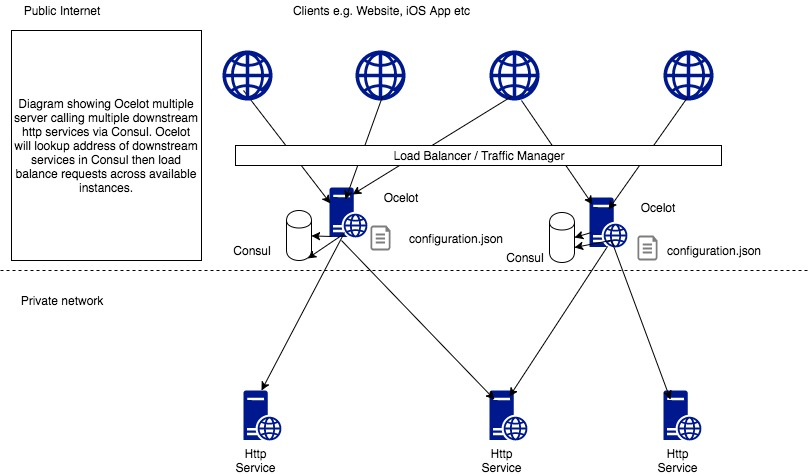

Big Picture
===========

Ocelot is a .NET API Gateway. This project is aimed at people using .NET running
a micro services / service orientated architecture
that need a unified point of entry into their system. However it will work with
anything that speaks HTTP and run on any platform that ASP.NET core supports.

In particular I want easy integration with IdentityServer reference and bearer tokens.
When I started Ocelot I could not find an easy way to do this with the existing API gateways
at the time.

Ocelot is a bunch of middlewares in a specific order and is added to a normal ASP.NET core
project as a NuGet package. Of course you can do whatever you want with the source code as Ocelot
is published with an MIT license.

Ocelot manipulates the ASP.NET HttpRequest object into a state specified by Ocelot's configuration until
it reaches a request builder middleware where it creates a HttpRequestMessage object which is
used to make a request to a downstream service. The middleware that makes the request is
the last thing in the Ocelot pipeline. It does not call the next middleware.
The response from the downstream service is retrieved as the requests goes back up the Ocelot pipeline.
There is a piece of middleware that maps the HttpResponseMessage onto the ASP.NET HttpResponse object and that
is returned to the client. In addition to this there is a code specific to creating the HttpClient that is
used for the request but that is basically it. We add all the features around this concept and it seems to be
working so far!

The following are configuration that you use when deploying Ocelot.

Basic Implementation
^^^^^^^^^^^^^^^^^^^^
.. image:: ../images/OcelotBasic.jpg

Here I am trying to convey what a basic, non distributed Ocelot setup might look like. The clients are calling Ocelot directly over HTTP (you might want to put something like nginx between Ocelot and www) and there is only one instance of Ocelot (It doesn't really matter what is hosting Ocelot for the purpose of these examples) and it is proxying requests to two downstream services. Ocelot is getting its configuration from a file called configuration.json (I reccomend calling this ocelot.json know but don't have time to update the images). In this example the services are in a private network so they cannot be accessed over www by anything other than Ocelot.

With IdentityServer
^^^^^^^^^^^^^^^^^^^
.. image:: ../images/OcelotIndentityServer.jpg

In this example the client gets a token from IdentityServer (proxied through Ocelot) and then uses it on subsequent requests to access authenticated APIs on the services in the private network. In this pattern the services in the private network do not need to implement authentication themselves. This is nice if you want to do a call like /api/user on your front end to get the users details. If you pass the token with your request Ocelot can parse the token, get the subject claim value and pass this to a downstream service e.g. userserviceip:port/getusers/subjectfromtoken. This is handling authentication as a cross cutting concern at API gateway level. The downstream service must trust what it receives from Ocelot and be in a private network that cannot be accessed from www or you will be in trouble because anyone could enumerate your endpoints and discover user information!! Please note you don't have to use IdentityServer for this approach. Many ASP.NET auth providers support the token workflow and it works in the same way apart from your identity provider won't be IdentityServer!

Multiple Instances
^^^^^^^^^^^^^^^^^^
.. image:: ../images/OcelotMultipleInstances.jpg

Here we are showing the basic example but we have a load balancer / traffic manager / reverse proxy in front of multiple instances of Ocelot. This is easy to do because Ocelot is stateless. Ocelot integrates with the ASP.NET CacheManager project so you can easily add a shared cache into this configuration if you wish to! It is worth noting with this configuration that you must redeploy all the instances of Ocelot for any configuration json changes. However as you will see as you read the docs there are ways around this.

With Consul
^^^^^^^^^^^
.. image:: ../images/OcelotMultipleInstancesConsul.jpg

In this example the the downstream service host/ip and ports are stored in Consul rather than the configuration json file. When a request is made to Ocelot it looks up the address of available services in Consul then loads balances requests across those services. Ocelot can load balance across service addresses in the configuration json file as well but I wanted to show this using Consul. In addition to Consul Ocelot can do this with Eureka as a service discovery provider.

With Service Fabric
^^^^^^^^^^^^^^^^^^^
.. image:: ../images/OcelotServiceFabric.jpg

With Kubernetes
^^^^^^^^^^^^^^^

