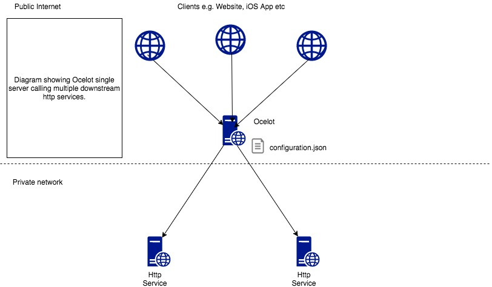
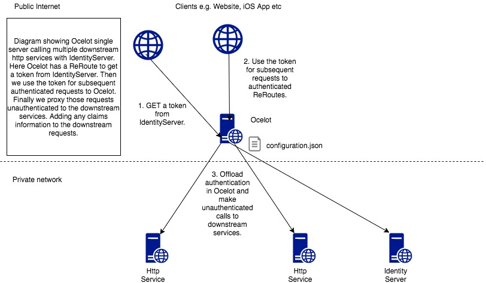
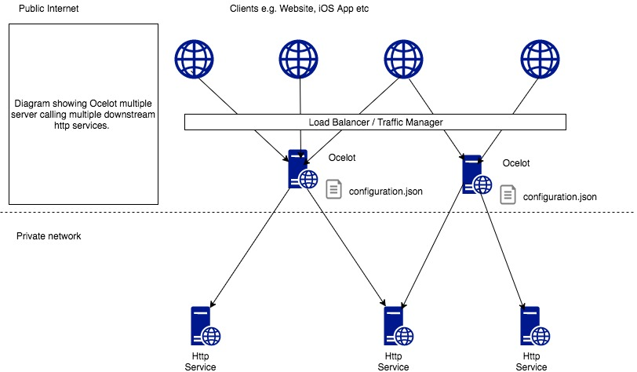
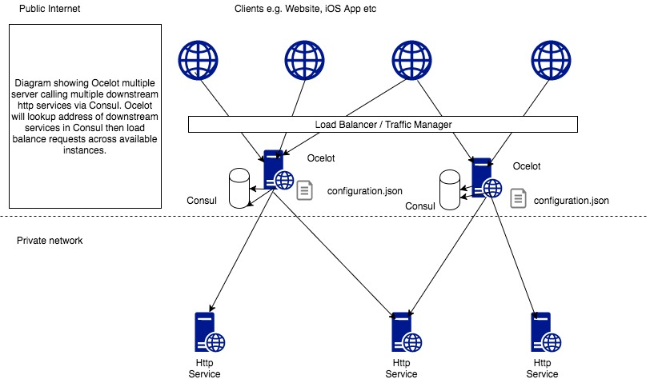
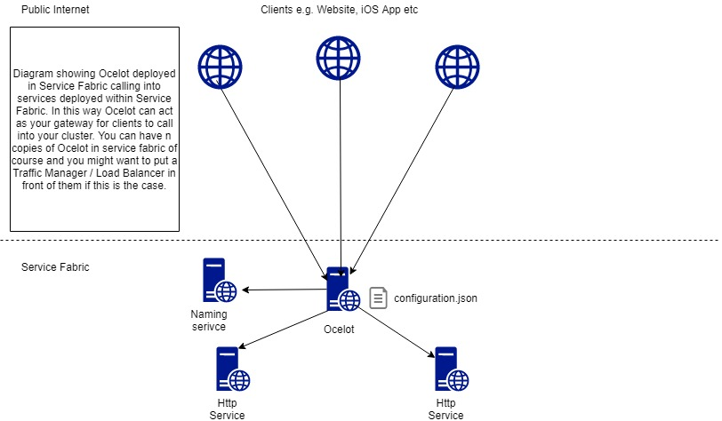

Big Picture
===========

Ocelot is aimed at people using .NET running 
a micro services / service orientated architecture 
that need a unified point of entry into their system.

In particular I want easy integration with 
IdentityServer reference and bearer tokens. 

Ocelot is a bunch of middlewares in a specific order.

Ocelot manipulates the HttpRequest object into a state specified by its configuration until 
it reaches a request builder middleware where it creates a HttpRequestMessage object which is 
used to make a request to a downstream service. The middleware that makes the request is 
the last thing in the Ocelot pipeline. It does not call the next middleware. 
The response from the downstream service is stored in a per request scoped repository 
and retrieved as the requests goes back up the Ocelot pipeline. There is a piece of middleware 
that maps the HttpResponseMessage onto the HttpResponse object and that is returned to the client.
That is basically it with a bunch of other features.

The following are configurations that you use when deploying Ocelot.

Basic Implementation
^^^^^^^^^^^^^^^^^^^^

With IdentityServer
^^^^^^^^^^^^^^^^^^^

Multiple Instances
^^^^^^^^^^^^^^^^^^

With Consul
^^^^^^^^^^^

With Service Fabric
^^^^^^^^^^^^^^^^^^^

